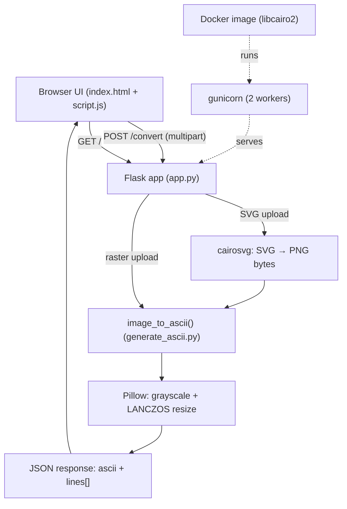

# Architecture

## System Diagram

## Component Descriptions

### Flask web layer
- **Purpose**: Serve the single-page UI and the conversion endpoint.
- **Location**: `app.py`
- **Key responsibilities**: Render `index.html`; validate uploads on `POST /convert` (extension allowlist, 16 MB cap, integer-clamped dimensions); rasterize SVG uploads via cairosvg; return ASCII as JSON; serve cached favicon/logo routes.

### Conversion core
- **Purpose**: Turn an image into ASCII rows.
- **Location**: `generate_ascii.py` (`image_to_ascii()`)
- **Key responsibilities**: Grayscale conversion, resize to the requested character grid with LANCZOS, and per-pixel brightness-to-character mapping. Also usable as a standalone CLI (`main()`).

### Browser front-end
- **Purpose**: Collect the image and settings and render live ASCII.
- **Location**: `templates/index.html`, `static/script.js`, `static/style.css`
- **Key responsibilities**: Width/height sliders synced to number inputs (clamped 10–200), character-set presets plus a custom field, debounced re-conversion, and copy/download of the result.

### Runtime / deployment
- **Purpose**: Run the app in production.
- **Location**: `Dockerfile`, `render.yaml`, `Procfile`
- **Key responsibilities**: Build a `python:3.12-slim` image with `libcairo2` installed, run gunicorn with 2 workers bound to Render's injected `$PORT`.

## Data Flow

1. The user selects an image and adjusts width, height, and character set in the browser.
2. `script.js` debounces input changes and POSTs the file plus settings to `/convert` as multipart form data.
3. `app.py` validates the file type and dimensions; if the upload is SVG, cairosvg rasterizes it to PNG bytes in memory first.
4. `image_to_ascii` converts to grayscale, resizes to the character grid, and maps each pixel's brightness to a character.
5. The endpoint returns JSON (`ascii` string + `lines[]`), and the browser renders it for preview, copy, or download.

## External Integrations

| Service | Purpose | Notes |
|---------|---------|-------|
| Pillow | Decode, grayscale, resize images | Core dependency |
| cairosvg | Rasterize SVG uploads to PNG | Needs `libcairo2` system library at runtime |
| Render | Hosting | Deployed as a Docker web service; injects `$PORT` |

## Key Architectural Decisions

### In-memory processing, no upload directory
- **Context**: Uploaded images only need to live long enough to convert.
- **Decision**: Read the file stream directly (and SVG → PNG bytes via `BytesIO`) without writing to disk.
- **Rationale**: Avoids temp-file cleanup, race conditions, and a writable-disk requirement on the host. A `MAX_CONTENT_LENGTH` of 16 MB and a max dimension of 300 cap memory use per request.

### Docker over a plain buildpack on Render
- **Context**: SVG conversion failed in production because cairosvg needs the native `libcairo2` library, which the default Python buildpack doesn't provide.
- **Decision**: Ship a Dockerfile that installs `libcairo2`, and point `render.yaml` at it.
- **Rationale**: Pinning the system dependency in the image is the only reliable way to make SVG uploads work in production; the alternative (hoping the platform's base image includes cairo) is brittle.

### gunicorn instead of the Flask dev server
- **Context**: `app.run()` is single-threaded and explicitly not for production.
- **Decision**: Serve via gunicorn with 2 workers in both `Procfile` and the Docker `CMD`.
- **Rationale**: Concurrent request handling and a production-grade WSGI server, with worker count kept low to fit a small instance.

### Safe-by-default error and input handling
- **Context**: A public endpoint accepting file uploads and free-form parameters is an attack surface.
- **Decision**: Validate the extension against an allowlist, clamp width/height to `[1, 300]`, return `400` for bad client input, and return a generic `500` message while logging the real exception server-side. Conversion errors are rendered as text, not HTML.
- **Rationale**: Prevents reflected XSS via error messages, avoids leaking internals, and stops a malicious request from exhausting memory through a huge resize.
