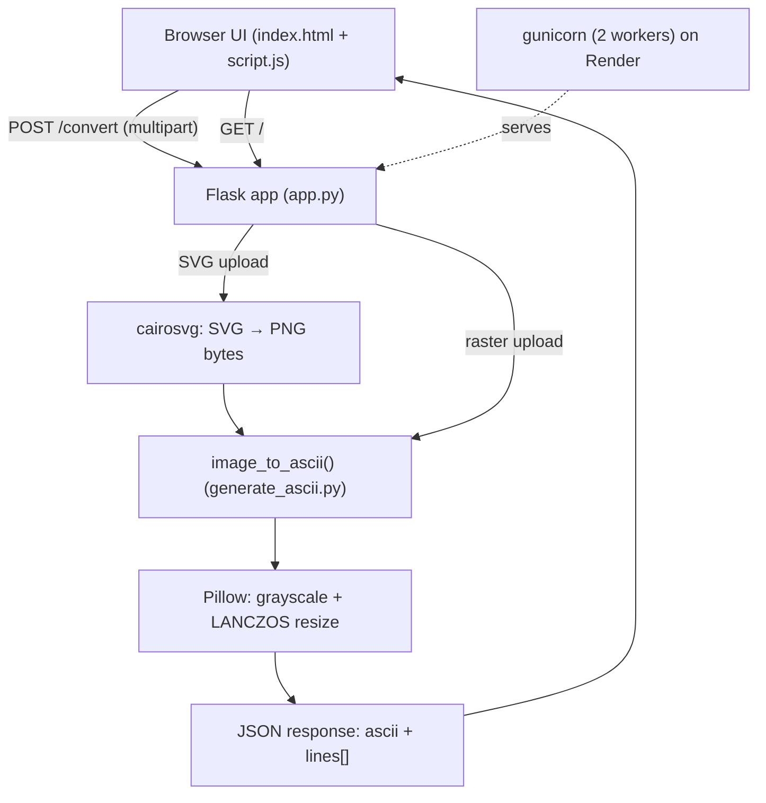

# Architecture

## System Diagram

## Component Descriptions

### Flask web layer
- **Purpose**: Serve the single-page UI and the conversion endpoint.
- **Location**: `app.py`
- **Key responsibilities**: Render `index.html`; validate uploads on `POST /convert` (extension allowlist, 16 MB cap, integer-clamped dimensions); rasterize SVG uploads via cairosvg; return ASCII as JSON; serve cached favicon/logo routes.

### Conversion core
- **Purpose**: Turn an image into ASCII rows.
- **Location**: `generate_ascii.py` (`image_to_ascii()`)
- **Key responsibilities**: Grayscale conversion, resize to the requested character grid with LANCZOS, and per-pixel brightness-to-character mapping. Also usable as a standalone CLI (`main()`).

### Browser front-end
- **Purpose**: Collect the image and settings and render live ASCII.
- **Location**: `templates/index.html`, `static/script.js`, `static/style.css`
- **Key responsibilities**: Width/height sliders synced to number inputs (clamped 10–200), character-set presets plus a custom field, debounced re-conversion, and copy/download of the result.

### Runtime / deployment
- **Purpose**: Run the app in production.
- **Location**: `render.yaml`, `Procfile`, `runtime.txt`
- **Key responsibilities**: Run on Render as a Python web service (Python 3.12 pinned in `runtime.txt`), installing dependencies with `pip install -r requirements.txt` and serving via gunicorn with 2 workers bound to Render's injected `$PORT`.

## Data Flow

1. The user selects an image and adjusts width, height, and character set in the browser.
2. `script.js` debounces input changes and POSTs the file plus settings to `/convert` as multipart form data.
3. `app.py` validates the file type and dimensions; if the upload is SVG, cairosvg rasterizes it to PNG bytes in memory first.
4. `image_to_ascii` converts to grayscale, resizes to the character grid, and maps each pixel's brightness to a character.
5. The endpoint returns JSON (`ascii` string + `lines[]`), and the browser renders it for preview, copy, or download.

## External Integrations

| Service | Purpose | Notes |
|---------|---------|-------|
| Pillow | Decode, grayscale, resize images | Core dependency |
| cairosvg | Rasterize SVG uploads to PNG | Relies on the cairo library available in Render's Python runtime |
| Render | Hosting | Python web service; auto-deploys `main` and injects `$PORT` |

## Key Architectural Decisions

### In-memory processing, no upload directory
- **Context**: Uploaded images only need to live long enough to convert.
- **Decision**: Read the file stream directly (and SVG → PNG bytes via `BytesIO`) without writing to disk.
- **Rationale**: Avoids temp-file cleanup, race conditions, and a writable-disk requirement on the host. A `MAX_CONTENT_LENGTH` of 16 MB and a max dimension of 300 cap memory use per request.

### Lazy SVG import to keep the rasterizer off the hot path
- **Context**: Only SVG uploads need cairosvg; raster formats (PNG/JPG/…) go straight to Pillow.
- **Decision**: `import cairosvg` lives inside the `if ext == 'svg'` branch in `app.py`, not at module top.
- **Rationale**: The app boots and serves every non-SVG request without touching cairosvg, so the rasterizer is only exercised when an SVG actually arrives — and the conversion path converges on the same `image_to_ascii` call for both input types.

### gunicorn instead of the Flask dev server
- **Context**: `app.run()` is single-threaded and explicitly not for production.
- **Decision**: Serve via gunicorn with 2 workers, declared in `render.yaml`'s start command (and mirrored in `Procfile`).
- **Rationale**: Concurrent request handling and a production-grade WSGI server, with worker count kept low to fit a small instance.

### Safe-by-default error and input handling
- **Context**: A public endpoint accepting file uploads and free-form parameters is an attack surface.
- **Decision**: Validate the extension against an allowlist, clamp width/height to `[1, 300]`, return `400` for bad client input, and return a generic `500` message while logging the real exception server-side. Conversion errors are rendered as text, not HTML.
- **Rationale**: Prevents reflected XSS via error messages, avoids leaking internals, and stops a malicious request from exhausting memory through a huge resize.
